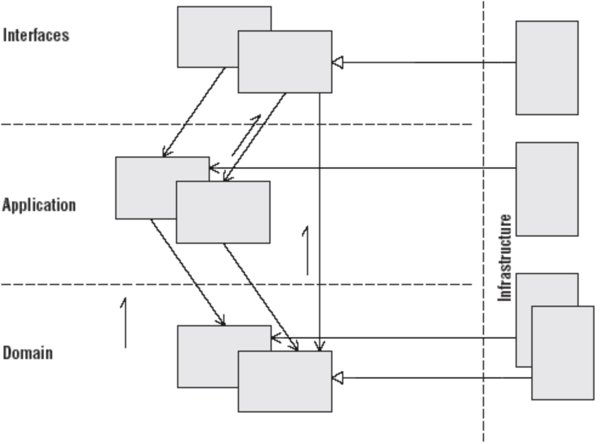

# 도메인 주도 설계와 계층형 구조

도메인 주도 설계와 CQRS는 마이크로서비스 아키텍처를 설 하는데에 사용할 수 있습니다. 도메인 주도 설계에서 계층형 구조는 크게 4개의 계층으로 이루어진 구조를 가지고 있으며, 각각의 계층은 인터페이스, 응용, 도메인, 인프라로 구성되어 있습니다. 각 계층은 서로다른 계층을 의존하고 있으며 가장 중요한 계층인 도메인 계층부터 살펴보고자 합니다.

> 도메인 주도 설계에서의 계층형 구조

## 도메인계층

도메인 계층은 도메인 주도 설계에서 가장 핵심이 되는 계층이자 어떠한 계층에도 의존하지 않는 가장 고수준의 계층입니다. 여기서는 Aggregate 단위로 구성된 도메인 모델이 구현되어 있습니다. Aggregate 이란 여러 Entity 와 Value Object 로 이루어져 있는 집합이자 도메인 모델을 정의하는 가장 기본이 되는 단위입니다. Aggregate root 가 되는 Root entity 를 반드시 하나 갖게 됩니다. 여기서 Entity 란 유일한 식별자로 구분이 필요한 객체를 이야기합니다. Entity 는 수정될 수 있으며, Entity 마다 가지고 있는 중복되지 않은 id 로 각각의 Entity 를 식별합니다. Value object 는 Entity 와 반대로 id 값을 가지지 않으며 불변한 객체로 수정할 수 없습니다. Value object 는 이름 그대로 값 그 자체를 표현하며 수정이 필요하다면 새로운 Value object 를 만들어서 사용하는 것을 원칙으로 합니다.

도메인 모델은 내부에는 도메인의 비지니스 로직이 위치합니다. 도메인 모델의 핵심적인 역할중에 하나인 중요한 비지니스 로직을 모델 내부로 감추고 도메인 모델이 어떠한 행위들을 하는지 명확히 표현할 수 있어야합니다. 도메인 모델 내부에서는 각각의 비지니스 로직이 실행됨에 따라 도메인 이벤트를 만들어  수 있어야합니다. 여기서 만들어진 도메인 이벤트들은 각각의 도메인 객체가 Repository 를 통해 영속화되는 시점에 발행될 수 있어야 하며 응용 계층에 위치한 도메인 이벤트 핸들러가 발행된 이벤트를 수신하여 처리할 수 있어야 합니다.

도메인 계층에는 도메인 모델을 영속화하고 도메인 계층에서 도메인의 컬렉션 인터페이스를 제공하기 위한 Repository 도 위치합니다. 다만 여기서는 Repository 의 인터페이스만을 정의하고 실제 구현체는 인프라 계층에서 하게 되는데, 이는 도메인에 대한 컬렉션 인터페이스를 제공하지만 도메인 객체의 영속화를 위한 구현은 도메인이 아닌 기술적 구현에 해당하기 때문에 분리된 인터페이스\(Separated interface\)를 적용하여 인터페이스와 구현체를 서로 다른 계층으로 분리합니다. 

하나 이상의 도메인 모델의 연산이나 도메인에 중요한 로직이지만 도메인 모델로 표현할 수 없는 경우가 있습니다. 이러한 경우에 사용하는것을 도메인 서비스라하고 이것 역시 도메인 계층에 속하게 됩니다. 도메인 모델 내부의 로직에서 표현하기 어색하거나 어려운 또는 도메인 모델에 온전히 책임을 맡길 수 없는 로직이나 연산의 경우 이를 억지로 도메인 모델 내부에서 표현하려고 하기보다 도메인 서비스로 명시하고 별도의 서비스로 구현하는 것이 좋습니다. 도메인 서비스는 그 자체로 상태를 갖지 않고 이는 온전히 도메인 모델과 응용 계층 서비스의 클라이언트가 될 수 있도록 구현해야 합니다. 또한 서비스를 구현할때에는 도메인 로직으로 충분히 해결할 수 없는 문제인지 반드시 서비스가 필요한지 확인하여 불필요하거나 꼭 필요하지 않는 서비스들로 도메인 모델이 빈약해지거나 서비스가 비대해지는 현상을 방지할 수 있어야합니다.

## 응용계층

응용 계층은 도메인 계층을 의존하고 도메인 모델의 도메인 로직을 실행하며, 다른 서비스와의 응용 계층과의 통신을 담당합니다. 이 계층은 도메인 계층에 대한 클라이언트로 동작하며 도메인에 대한 어떠한 것도 포함하지 않습니다. 도메인을 호출하고 작업에 대한 조율만을 담당하기 때문에 이 계층은 작게 유지되어야 합니다. 

CQRS 의 Command 와 Command handler 가 여기에 위치하여 도메인의 변경을 담당하며 발생한 도메인 변경을 통합 이벤트 혹은 서비스 호출 등을 통하여 서비스의 외부로 전파합니다. 

## 인터페이스계층

인터페이스 계층에서는 응용 계층을 의존하고,  CQRS의 Command, Query 를 생성하여 각각의 Bus 를 통해 실행합니다. 이 계층에서는 서비스에 대한 인터페이스를 제공하며 인터페이스의 대상은 사용자 혹은 다른 서비스, 프로그램 등 서비스를 이용할 수 있는 모든 종류의 클라이언트가 해당됩니다. 이를 위해 HTTP, gRPC 등 프로토콜을 이용하거나 UX/UI 등으로 사용자 인터페이스를 구성할 수 있습니다. 클라이언트의 요청을 검증하고 응답하는 역할도 담당합니다.

## 인프라계층

인프라 계층에서는 다른 각 계층에서의 세부적인 기술 구현을 담당합니다. 이는 도메인 계층의 영속화를 위한 Repository 의 데이터베이스 시스템, 응용 계층의 Message protocol 을 위한 Publisher, Subscriber 와 통신을 위한 Adapter, 인터페이스 계층 의 Controller 를 위한 프로토콜 등의 기술적인 내용들 입니다. 이러한 세부 구현을 인프라 계층에서 모두 담당하게 함으로써 기술적인 부분이 변경되어도 변경사항이 다른 부분으로 퍼지지 않도록 격리하고 의존성 역전을 구현할 수 있습니다.

